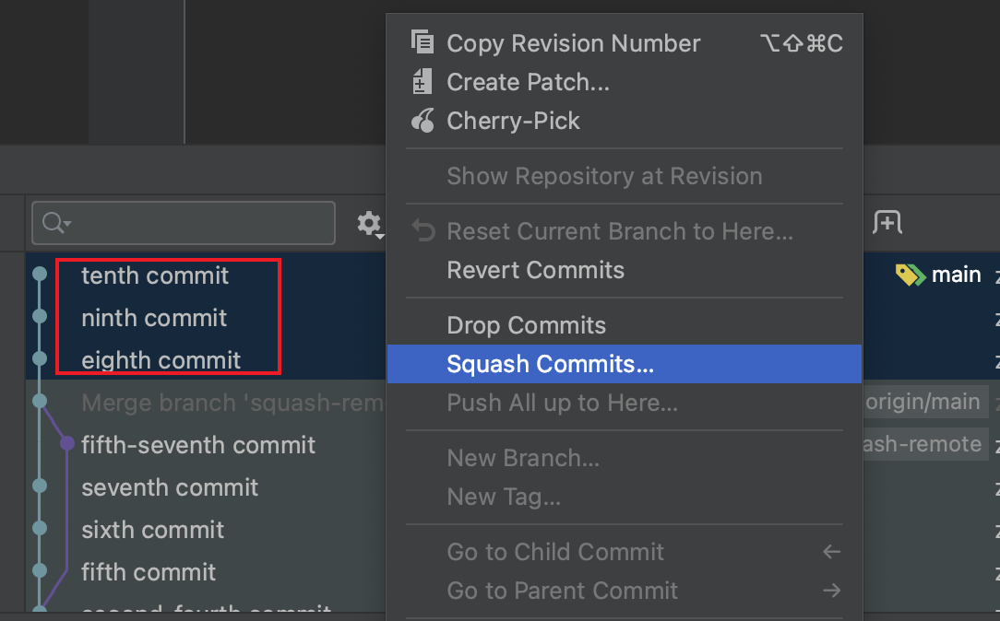
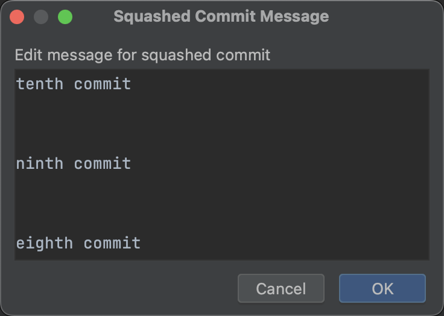
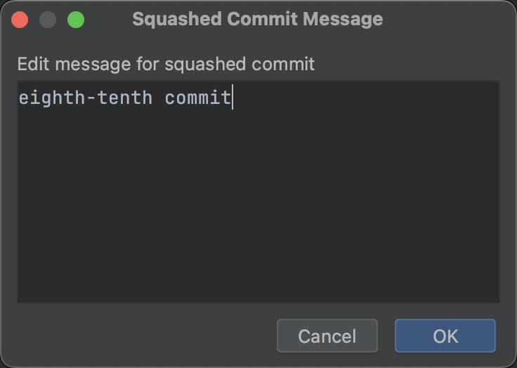

# 合并多个提交

## Reference

* https://blog.csdn.net/kangsa998/article/details/104247156
* https://zhuanlan.zhihu.com/p/462530860
* https://www.jianshu.com/p/684a8ae9dcf1

## WebStorm







观察git日志，原理也是git rebase
```bash
git rebase --interactive --no-autosquash 0bacee8521e30ddb542343f14b7b106e9c487c8e
```

## squash merge

```bash
git checkout main
git merge --squash squash-merge
git commit -m "squash merge: klm commit"
```

## rebase merge

```bash
git rebase -i main
git checkout main
git merge rebase-merge
```
